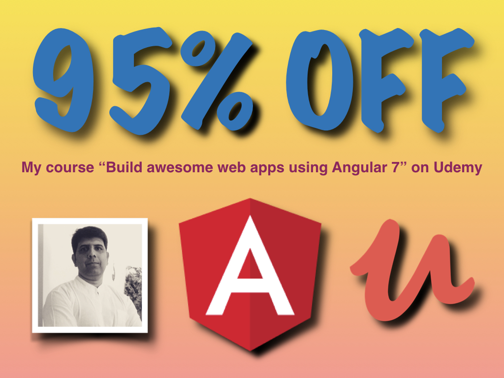

# TypeORM training

for Unisys 22nd-23rd November, 2018

Links to reference material:

* <a href='https://vinod.co/resources/Nodejs.pdf'>Nodejs</a>
* <a href='https://vinod.co/resources/MongoDB.pdf'>Mongodb</a>
* <a href='http://typeorm.io/'>TypeORM</a>
* <a href='https://vinod.co/resources/Angular-Vinod.pdf'>Angular</a>

<table>
<tr>
    <td>
        
    </td>
    <td>
        
    </td>
</tr>
</table>

